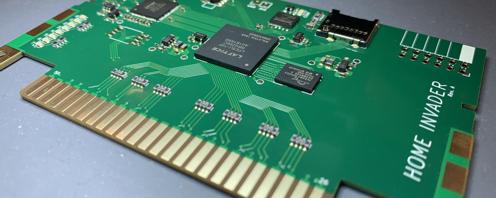

# Home Invader 64

This is a present for an old friend!

## Prerequisites

Get these taps:

    $ brew tap nelgau/fpga
    $ brew tap riscv-software-src/riscv

Install the following packages:

    $ brew install --HEAD yosys
    $ brew install --HEAD nextpnr-ecp5
    $ brew install --HEAD ecpprog
    $ brew install riscv-tools
    $ brew install icarus-verilog

Note: Building `nextpnr-ecp5` takes approximately 11 minutes on an M1 MacBook Pro.

Build a recent Python with shared object support (for cocotb) using pyenv:

    $ PYTHON_CONFIGURE_OPTS="--enable-shared" pyenv install 3.10.6
